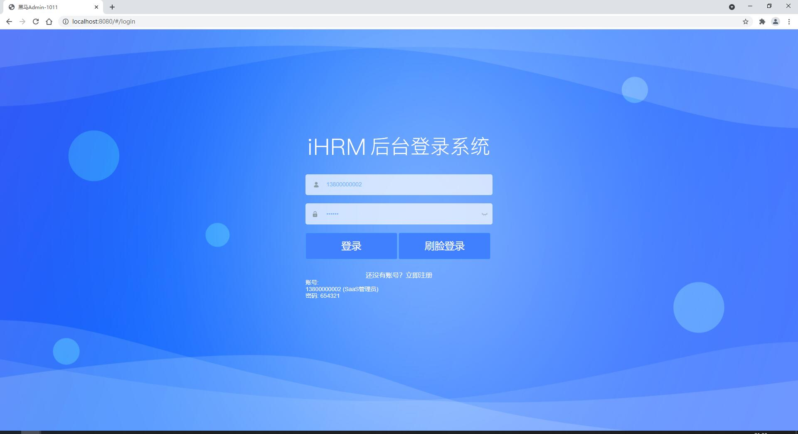

## SaaS-HRM

   
   
   

   
  
   

#### 一、演示地址

http://ihrm-java.itheima.net/#/login

#### 二、项目介绍

SaaS-HRM是基于saas模式的人力资源管理系统。他不同于传统的人力资源软件应用，使用者只需打开浏览器即可 管理上百人的薪酬、绩效、社保、入职离职。

#### 项目启动

页面启动

安装：yarn

运行：npm start